# TrackIt — Phase 1 End-to-End

**Core task management.** This document records what Phase 1 delivered and how it works end to
end — from the React UI, through the REST API and service layer, down to the PostgreSQL schema.
It describes the system **as built**, not the full product vision.

- Complete domain model (all eight modules): [`DOMAIN.md`](DOMAIN.md)
- Engineering rules and conventions: [`../AGENTS.md`](../AGENTS.md)
- Architecture decisions: [`adr/`](adr/)

---

## 1. Where Phase 1 sits

TrackIt is delivered in three phases. Each phase is two sprints and covers two Jira epics.

| Phase | Sprints | Tickets | Scope | Status |
| --- | --- | --- | --- | --- |
| **Phase 1 — Core task management** | 1–2 | TRACKIT-12 → 23 | Company structure, goals, tasks, assignment | ✅ **Delivered** |
| Phase 2 — Timesheets & resource management | 3–4 | TRACKIT-24 → 30 | Time logging, effort tracking, workload dashboards | Not started |
| Phase 3 — Prioritisation, risk & advanced features | 5–6 | TRACKIT-31 → 38 | Priority scoring, dependencies, risk detection | Not started |

Phase 1 delivers the **Identity & Organisation** and **Work** contexts from
[`DOMAIN.md`](DOMAIN.md) — five of the eight modules. It sets the patterns every later phase
copies: the four-layer module shape, the two-place authorization model, query-level scoping,
projections at the service boundary, and migration-only schema change.

### Tickets delivered

**Sprint 1 — foundation: who exists and how they are grouped**

| Ticket | What it added |
| --- | --- |
| TRACKIT-12 | Backend scaffold — Express + TypeORM + PostgreSQL, layered module structure, `/health` |
| TRACKIT-13 | JWT authentication backend + login UI, persistent session, protected routes |
| TRACKIT-14 | Role and scope authorization (`requireRole`, `ScopeService`, query-level data scoping) |
| TRACKIT-15 | Super Admin user management (create + list) |
| TRACKIT-16 | Team creation and scoped team details |
| TRACKIT-17 | Team membership and lead assignment |
| TRACKIT-18 | Seed of the demo company structure |
| TRACKIT-39 | Frontend sends API requests to the backend base URL (removed the Vite dev proxy) |

**Sprint 2 — the work: what needs doing and who is doing it**

| Ticket | What it added |
| --- | --- |
| TRACKIT-19 | Goal management API — create, list, read, update team goals with lifecycle status |
| TRACKIT-20 | Task creation and editing under a goal (Team Lead / Super Admin) |
| TRACKIT-21 | Task assignment to a team member (Team Lead only) |
| TRACKIT-22 | Employee **My Tasks** view + task status updates |
| TRACKIT-23 | Goal progress calculated from completed tasks |

**Modules implemented:** `auth`, `users`, `teams`, `goals`, `tasks` — plus the `health`
infrastructure module.

### Not yet built

The remaining three modules from `DOMAIN.md` have **no** entities, endpoints, or pages. On the
frontend they appear only as label-only sidebar items with no route:

- **Effort** — `timesheets` (Phase 2)
- **Insight** — `dashboards`, `audit` (Phases 2–3)

Some fields exist in the Phase 1 schema but are **deliberately inert**, reserved for Phase 3:
`Task.businessImpact` and `Task.priorityScore` are always `null`, and task **dependencies /
blocked-by** relationships have no table yet. The scoring and workload tunables in
`backend/src/common/config/constants.ts` mirror `DOMAIN.md` exactly but are not consumed by any
Phase 1 code — except `DEFAULT_WEEKLY_CAPACITY` and `MIN_PASSWORD_LENGTH`, which are.

---

## 2. The system in one picture

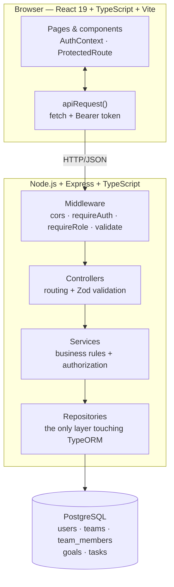

Five modules, grouped into the two contexts Phase 1 covers:

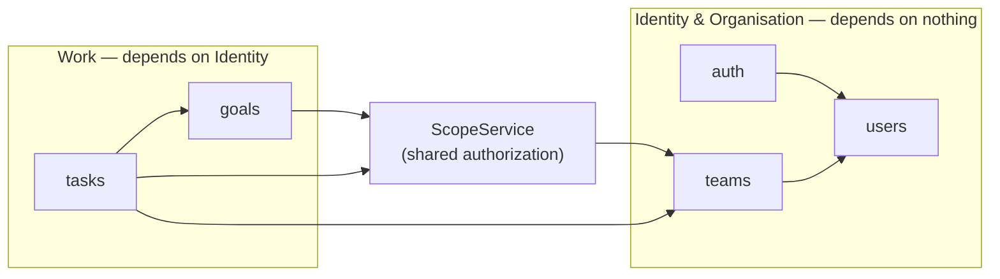

Every arrow is a **service-to-service** call. Per `AGENTS.md`, cross-module reads always go
through the other module's service, never its repository — with one documented exception noted in
§3.

---

## 3. Architecture

### Stack

| Layer | Technology |
| --- | --- |
| Frontend | React 19 + TypeScript + Vite + React Router |
| Backend | Node.js + Express + TypeScript |
| Database | PostgreSQL + TypeORM (`synchronize: false`, migrations only) |
| Validation | Zod, at the controller boundary |
| Auth | JWT (HS256, 24h) + bcrypt password hashing |
| Tests | `node --test` (161 backend tests, all four layers) |
| Dev | Docker Compose |

### The four-layer convention

Every backend module lives under `backend/src/modules/<module>/` with one file per layer:

```
<module>.controller.ts   HTTP: routing, request/response, Zod validation
<module>.service.ts      business logic, authorization, orchestration
<module>.repository.ts   data access — the only layer that touches TypeORM
<module>.entity.ts       TypeORM entity definitions (no logic)
```

**Hard rules** (from `AGENTS.md`):

- Controllers never import repositories.
- Business rules and authorization live in services, nowhere else.
- Cross-module reads go through the other module's **service**.
- Entities carry no logic.
- Services return **projections**, not entities — a password hash can never leak by accident.

Dependencies are wired **by hand** in `backend/src/app.ts` — no DI container. The whole object
graph is one readable block:

```ts
const usersService  = new UsersService(new UserRepository(AppDataSource));
const teamsService  = new TeamsService(new TeamRepository(AppDataSource), usersService);
const scopeService  = new ScopeService(teamsService);
const taskRepository = new TaskRepository(AppDataSource);
const goalService   = new GoalService(new GoalRepository(AppDataSource), taskRepository, scopeService);
const taskService   = new TaskService(taskRepository, goalService, teamsService, scopeService);
const authService   = new AuthService(usersService, env.JWT_SECRET);
```

Three cross-module dependencies are worth calling out:

- **`TaskService` → `GoalService`** — every task operation first resolves and authorises its
  parent goal through `goalService.getGoal()`. That single call is where team scope is enforced
  for all task work; the task service never re-derives it.
- **`TaskService` → `TeamsService`** — assignee **names** are resolved by reading the goal's team
  via `teamsService.getTeamDetails()`, and only when at least one task in the batch is assigned.
- **`GoalService` → `TaskRepository`** *(the one exception)* — a direct repository dependency for
  a single narrow read: the grouped task-status counts that produce goal progress. It is a batched
  aggregate that would be awkward to route through the task service, and it is strictly read-only.

### Request lifecycle

Every request follows the same path. Nothing skips a layer.

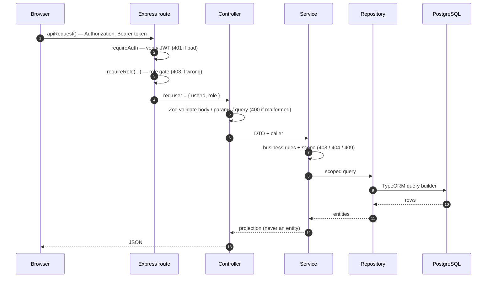

**Errors.** Any layer may `throw`; the central handler
(`backend/src/common/middleware/error-handler.ts`) maps the domain error hierarchy to HTTP and
serialises one consistent shape. No service ever sets a status code directly.

| Error class | Status | Meaning |
| --- | --- | --- |
| `ValidationError` | 400 | Understood but semantically invalid |
| `UnauthorizedError` | 401 | No token, expired, or malformed |
| `InvalidCredentialsError` | 401 | Login failed — identical for unknown email and wrong password |
| `ForbiddenError` | 403 | Valid token, wrong role or out of scope |
| `NotFoundError` | 404 | Resource does not exist |
| `ConflictError` | 409 | Conflicts with current state (uniqueness, invariant) |

```json
{ "error": { "message": "..." } }
```

The frontend `apiRequest` reads `error.message` back out of that shape
(`frontend/src/api/client.ts`), so every failure surfaces a real sentence in the UI.

---

## 4. Authentication & authorization

### Login and session

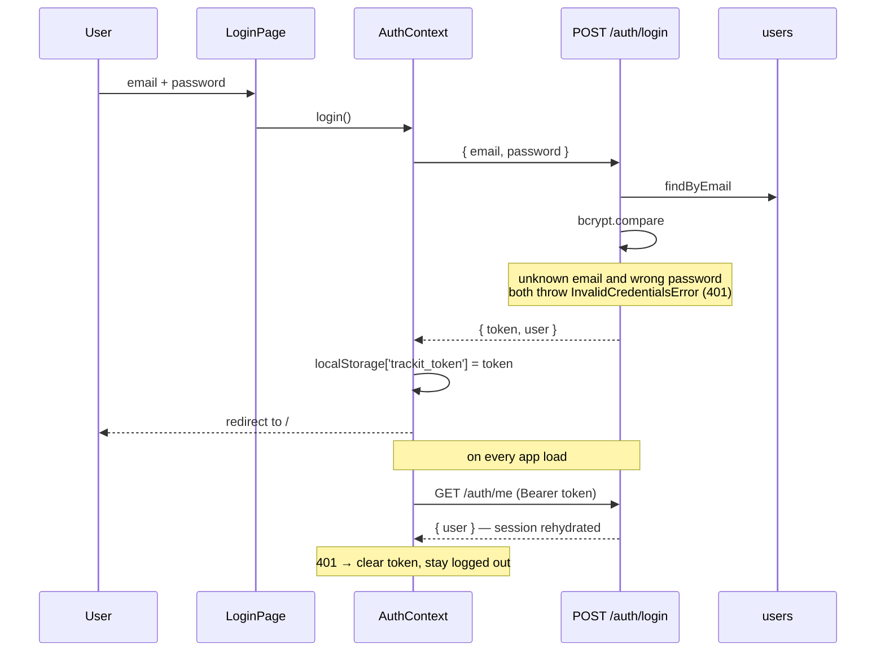

The JWT carries `{ userId, role }` and expires in 24 hours. `GET /auth/me` returns the user's
safe projection (`id`, `email`, `name`, `role`) — never the hash.

### Two places for authorization, never anywhere else

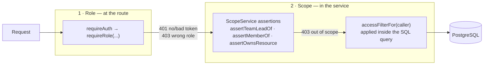

**Role at the route** — `requireAuth` then `requireRole('SUPER_ADMIN', ...)`
(`common/middleware/authenticate.ts`, `authorize.ts`). Missing, expired or malformed token →
**401**; valid token but wrong role → **403**.

**Scope in the service** — two complementary mechanisms:

1. **Resource-level assertions** via `ScopeService` (`common/authorization/scope.service.ts`):

   | Assertion | Question it answers |
   | --- | --- |
   | `assertTeamLeadOf(userId, teamId)` | Does this person lead that team? |
   | `assertMemberOf(userId, teamId)` | Does this person belong to that team? |
   | `assertOwnsResource(userId, ownerId)` | Is this person the owner of this record? |

   Goals and tasks wrap these in two helpers applied per role:

   - `assertCanManageTeam(caller, teamId)` — Super Admin passes; Team Lead must lead the team;
     Employee is rejected. **Gates every write.**
   - `assertCanViewTeam(caller, teamId)` — Super Admin passes; Team Lead must lead the team;
     Employee must be a member. **Gates every read.**

2. **Query-level filters** — data is filtered *in the query*, not after it, so out-of-scope rows
   are never fetched.

   | Role | `TeamsService.accessFilterFor` | `TaskService.accessFilterFor` |
   | --- | --- | --- |
   | Super Admin | `{}` — everything | `{}` — everything |
   | Team Lead | `{ leadId }` — teams they lead | `{ teamId }` — all tasks in their team's goals |
   | Employee | `{ memberId }` — teams they belong to | `{ teamId, assigneeId }` — only their own tasks |

   An employee reading a goal's task list sees only their own tasks, filtered in SQL, never in
   React. This is a data-access rule, not a display rule (`DOMAIN.md` §Access model).

### The 404-then-403 pattern

Goal and task reads deliberately look the resource up **twice**:

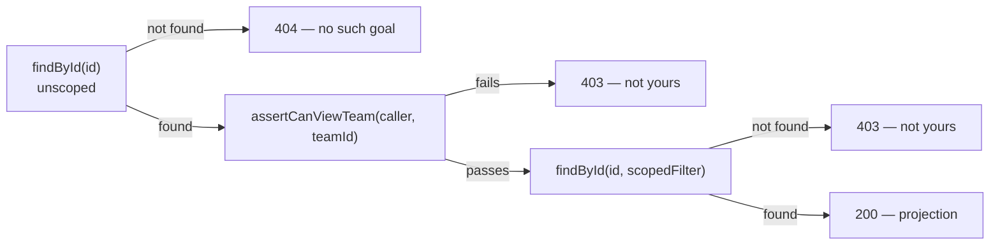

This distinguishes *"no such goal"* from *"exists, but not yours"* consistently, rather than
leaking existence across teams by accident.

### Access model (Phase 1 surface)

Adapted from `DOMAIN.md` for what exists today.

| | Super Admin | Team Lead | Employee |
| --- | --- | --- | --- |
| **Users** | | | |
| Create / list users | ✅ | — | — |
| **Teams** | | | |
| Create team | ✅ | — | — |
| List teams | all | teams they lead | teams they belong to |
| View team details | all | own team | own team |
| Add / remove members | ✅ | — | — |
| Assign team lead | ✅ | — | — |
| **Goals** | | | |
| Create goal | ✅ | own team | — |
| List / view team goals | all | own team | own team (read-only) |
| Update goal | ✅ | own team | — |
| **Tasks** | | | |
| Create task | ✅ | own team | — |
| Update task fields | ✅ | own team | — |
| Assign / reassign task | — | **own team only** | — |
| Update task status | ✅ | own team | **own tasks only** |
| List / view tasks | all | own team | assigned only |
| **My Tasks** | — | — | ✅ |

Two rows deserve a note:

- **Task assignment is Team-Lead-only** — not even Super Admin can assign. The route is
  `requireRole(TEAM_LEAD)` and the service re-checks `caller.role === TEAM_LEAD`. Assignment is
  treated as a team-leadership act, not an administrative one.
- **Employees can read team data through the API** (`GET /teams`, `GET /teams/:id` are scoped, not
  role-gated) but the frontend gives them no `/teams` route — their sidebar goes straight to
  **Team Goals** and **My Tasks**.

---

## 5. Data model

Five tables, seven migrations. `synchronize` is off — the schema only ever changes through a
migration.

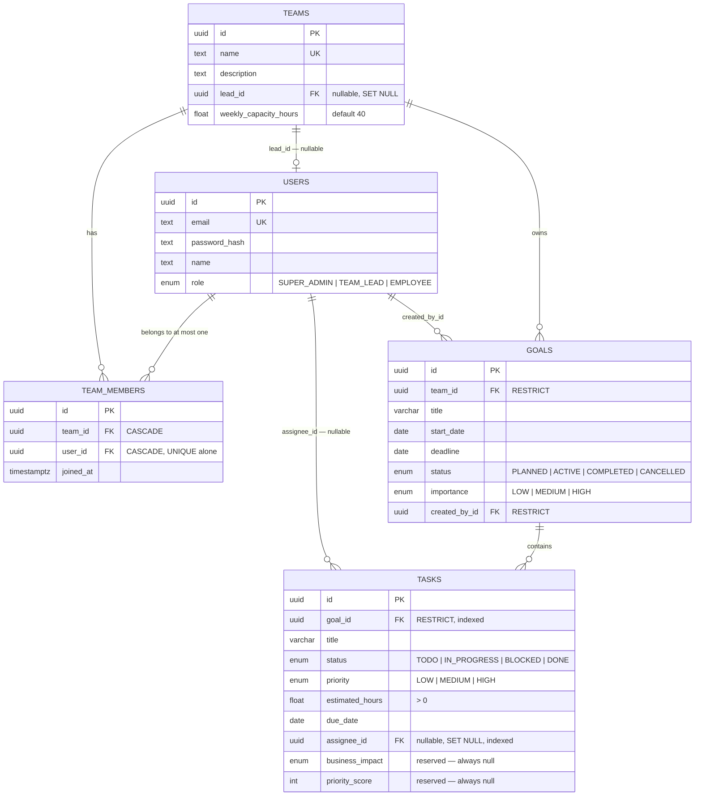

All five tables also carry `created_at` / `updated_at` as `timestamptz` (except `team_members`,
which carries `joined_at`).

### Constraints that encode domain rules

| Rule (`DOMAIN.md`) | Where it is enforced |
| --- | --- |
| An email identifies exactly one user | `users.email` UNIQUE + service check → 409 |
| A team name is unique | `teams.name` UNIQUE + service check → 409 |
| An employee belongs to at most one team | `team_members.user_id` UNIQUE **alone** (see [ADR 0001](adr/0001-one-team-per-user.md)) |
| A team lead is a member of the team they lead | Service: `assignTeamLead` rejects a non-member → 409 |
| The lead cannot be removed until replaced | Service: `removeMember` rejects the current lead → 409 |
| A goal's deadline falls after its start date | Service: `assertValidDates` → 400 |
| Estimated hours are greater than zero | Zod `.positive()` → 400, re-checked in service |
| A task's assignee is a member of the goal's team | Service: `assertMemberOf(assigneeId, teamId)` → 403 |

### Referential intent

- **Goals use `ON DELETE RESTRICT`** toward both `teams` and `users` — you cannot delete a team or
  a user that still owns goals. Work history is protected.
- **Tasks use `RESTRICT`** toward `goals` for the same reason, and **`SET NULL`** toward
  `users.assignee_id` — matching the domain rule that a task may be unassigned. Deleting a user
  simply unassigns their tasks.
- **`team_members` cascades** on both sides — a membership row has no meaning without its team or
  its user.

Entities use **plain FK columns**, not TypeORM relation decorators; joins are written explicitly
in the query builders. This keeps the generated SQL predictable and reviewable.

### Migration history

| # | Migration | Purpose |
| --- | --- | --- |
| 1 | `1754640000000-InitialSetup` | No-op — bootstraps the TypeORM migrations table |
| 2 | `1754640100000-CreateUsers` | `users` table + `user_role_enum` |
| 3 | `1754640200000-CreateTeamsAndMembership` | `teams` table, originally with a `users.team_id` FK |
| 4 | `1754640300000-ExpandTeams` | Adds `description`, `weekly_capacity_hours`, timestamps to `teams` |
| 5 | `1754640400000-CreateTeamMembers` | Introduces `team_members`, migrates data from `users.team_id`, then **drops `users.team_id`** |
| 6 | `1754640500000-CreateGoals` | `goals` table + `goal_status_enum`, `goal_importance_enum` |
| 7 | `1754640600000-CreateTasks` | `tasks` table + task enums, indexes on `goal_id` and `assignee_id` |

Migration 5 is the interesting one — it is a **three-step data migration**, not just a schema
change: create the new table, copy the existing memberships across, then drop the old column.

---

## 6. Lifecycles and derived values

### Goal and task lifecycle

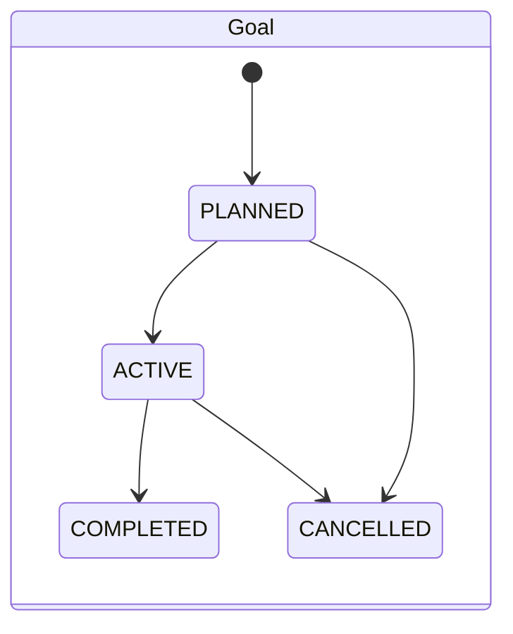

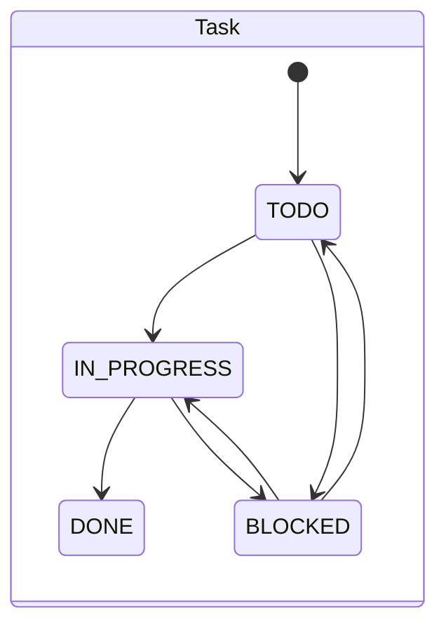

A new goal is always created `PLANNED`; a new task is always created `TODO` and **unassigned**.
Status transitions are not restricted in code — any status may be set — because the lifecycle
above describes intent, and blocking real-world corrections adds friction without adding safety.

**Goal status is set by a human, never derived.** A goal at 100% progress stays `ACTIVE` until
someone marks it `COMPLETED`. Deriving `COMPLETED` from task counts would conflict with
`CANCELLED` being a deliberate decision, and the progress percentage already communicates
completion (`DOMAIN.md` §Lifecycle).

**Task `BLOCKED` is a manual status here.** It is kept deliberately separate from the future
dependency-derived blocked state described in `DOMAIN.md` — "waiting on TASK-104" and "blocked
because the vendor hasn't replied" are different things, and Phase 1 only implements the second.

### Values computed on read, never stored

| Value | Formula | Where |
| --- | --- | --- |
| `progress` | `tasks DONE / total tasks × 100` | `GoalService.progressFromCounts` |
| `noTasksYet` | `total === 0` | same |
| `taskStatusBreakdown` | grouped counts: `total`, `todo`, `inProgress`, `blocked`, `done` | same |
| `overdue` | `dueDate < today && status !== DONE` | `TaskService.isTaskOverdue` |
| `dueDatePastGoalDeadline` | `task.dueDate > goal.deadline` | `TaskService.toProjection` |

None of these are columns. Storing them would create a second source of truth that could drift
from the tasks themselves.

---

## 7. Feature walkthroughs

### 7.1 Login & session (TRACKIT-13)

```
LoginPage.tsx  ──►  AuthContext.login()  ──►  POST /auth/login  →  { token, user }
   token → localStorage['trackit_token'];  user → React context;  redirect to /

on app load:
AuthContext (mount)  ──►  GET /auth/me  →  { user }        (rehydrate)
                          401 → clear token, stay logged out
```

- **UI:** `frontend/src/pages/LoginPage.tsx`, `auth/AuthContext.tsx`, `auth/ProtectedRoute.tsx`.
- `ProtectedRoute` gates rendering while auth resolves, redirects unauthenticated users to
  `/login`, and redirects users lacking an allowed role back to `/`.
- **Backend:** `auth.controller.ts` → `auth.service.ts` → `users.service.ts`.

### 7.2 User management (TRACKIT-15)

```
UsersPage.tsx
  ├─ UserCreationForm ──► POST /users   { name, email, password, role } → { user }
  └─ role filter      ──► GET  /users?role=&unassigned= → { users }
```

- The whole `users` router is gated `requireAuth` + `requireRole(SUPER_ADMIN)` at mount, so every
  route inherits it — no per-route repetition.
- `createUser` checks email uniqueness (**409**), hashes with bcrypt, and returns a projection
  **without** the hash.
- `listUsers` supports `?role=<ROLE>` and `?unassigned=true` (users in no team). Returned records
  carry each user's `teamId`, or `null` — this is what powers the "add a member" picker.
- Emails are trimmed and lowercased at the boundary; passwords must be at least
  `MIN_PASSWORD_LENGTH` characters.

### 7.3 Team management (TRACKIT-16, TRACKIT-17)

```
TeamsPage.tsx
  ├─ TeamCreationForm (SA) ──► POST /teams  { name, description?, weeklyCapacityHours? } → { team }
  └─ team list             ──► GET  /teams  → { teams }   (role-scoped)

TeamDetailsPage.tsx        ──► GET /teams/:id → { team: { …, lead, members, memberCount } }
  ├─ TeamMemberAssignmentForm ──► POST   /teams/:id/members         { userId } → { member }
  ├─ member removal           ──► DELETE /teams/:id/members/:userId → 204
  └─ TeamLeadSelector         ──► PUT    /teams/:id/lead            { userId } → { lead }
```

**Backend rules** (`teams.service.ts`):

- **Create team** — name must be unique (**409**); capacity defaults to `DEFAULT_WEEKLY_CAPACITY`
  (40); a new team starts with **no lead**.
- **List / details** — filtered by `accessFilterFor(caller)`. `getTeamDetails` returns **404** if
  the team does not exist and **403** if it exists but is out of scope. Details include the
  resolved `lead`, the `members` list, and `memberCount`.
- **Add member** — the user must exist (**404**) and be an `EMPLOYEE` (**409**). One-team-per-user
  is enforced: already in this team, or already in another team → **409**.
- **Assign lead** — the target must already be a member (**409**). The repository does this
  **transactionally with a pessimistic lock**: promote the new user to `TEAM_LEAD`, demote the
  previous lead back to `EMPLOYEE`, and update `teams.lead_id` — three writes that must not
  interleave with another assignment.
- **Remove member** — must be a current member (**404**); the **current lead cannot be removed**
  until another lead is assigned (**409**).

### 7.4 Goal management (TRACKIT-19)

```
TeamGoalsPage.tsx
  ├─ team selector (SA) ──► GET /teams                        → pick a team
  ├─ GoalCreationForm   ──► POST /goals   { teamId, title, description?,
  │                                          startDate, deadline, importance } → { goal }
  └─ goals table        ──► GET /teams/:teamId/goals?status=  → { goals }  (each with progress)

GoalDetailsPage.tsx     ──► GET /goals/:id → { goal }  (progress + breakdown)
```

- **UI:** `pages/TeamGoalsPage.tsx`, `GoalDetailsPage.tsx`, `components/GoalCreationForm.tsx`,
  `GoalStatusBadge.tsx`, `GoalProgress.tsx`, `goal-display.ts` (deadline countdown / overdue text).
- **Create goal** — `assertCanManageTeam`; the **deadline must fall strictly after the start
  date** (**400** otherwise); a new goal is always `PLANNED`; `createdById` is stamped from the
  caller, never from the body.
- **List** — `assertCanViewTeam`, ordered by deadline then title, optional `?status=` filter.
  Progress for **every** goal in the list is loaded in **one grouped query**
  (`countByGoalIdsAndStatus`) — an explicit N+1 avoidance, and the reason `GoalService` is allowed
  to touch `TaskRepository` directly.
- **Get / update** — the 404-then-403 pattern. Update accepts a partial body (at least one field)
  and re-validates dates against the **merged** start/deadline, so changing only the start date
  still cannot invert the range.
- **Importance** (`LOW | MEDIUM | HIGH`) is stored but not yet consumed — it feeds priority
  scoring in Phase 3.

### 7.5 Task creation & editing (TRACKIT-20)

```
GoalDetailsPage.tsx
  ├─ TaskCreationForm ──► POST  /goals/:goalId/tasks  { title, description?, priority,
  │                                                      estimatedHours, dueDate } → { task }
  ├─ TaskList         ──► GET   /goals/:goalId/tasks  → { tasks }   (role-scoped)
  └─ edit             ──► PATCH /tasks/:id
TaskDetailsPage.tsx   ──► GET   /tasks/:id            → { task }
```

- **UI:** `components/TaskCreationForm.tsx`, `TaskList.tsx`, `TaskStatusBadges.tsx`, and
  `pages/TaskDetailsPage.tsx` (single-task view with assignment controls for a Team Lead).
- **Create task** — resolves the parent goal through `goalService.getGoal` (which authorises the
  caller), then `assertCanManageTeam`. **Estimated hours must be > 0** (**400**). New tasks start
  `TODO`, unassigned, with `businessImpact` and `priorityScore` `null`.
- **A due date after the goal's deadline is allowed but flagged.** The projection carries
  `dueDatePastGoalDeadline` so the UI can warn without blocking — a real plan sometimes needs a
  task that outruns its goal, and the person should see it, not be stopped by it.
- **Update task** — partial body, `assertCanManageTeam`, re-validates the estimate if changed.
  Bodies are `.strict()`, so unknown fields are rejected rather than silently ignored.

### 7.6 Task assignment (TRACKIT-21)

```
TaskList row / TaskDetailsPage ──► AssigneeSelect ──► PUT /tasks/:id/assignee
                                                       { assigneeId | null } → { task }
```

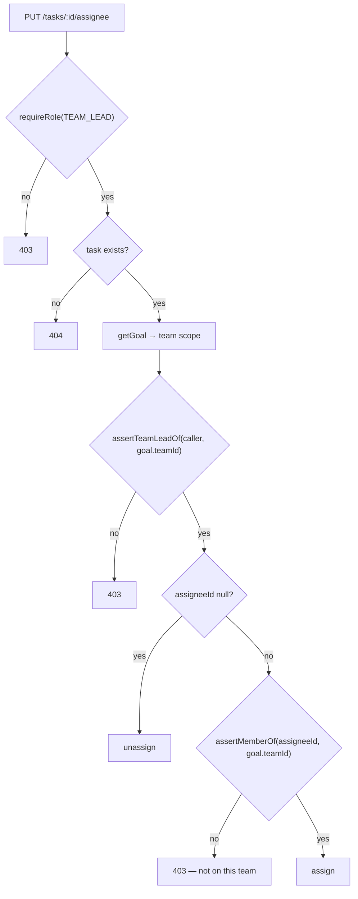

The `assertMemberOf` check is what enforces the domain invariant *a task's assignee is a member of
the team owning the task's goal*. `AssigneeSelect` renders only when `canAssign` (Team Lead); the
member list comes from `GET /teams/:teamId`.

### 7.7 My Tasks & status updates (TRACKIT-22)

```
MyTasksPage.tsx
  ├─ filters (status, dueBefore) + sort (deadline | priority)
  ├─ GET /tasks/mine?status=&dueBefore=   → { tasks }   (each with its parent goal)
  └─ TaskStatusSelect ──► PATCH /tasks/:id/status  { status } → { task }
```

- **`GET /tasks/mine`** — `findByAssignee(callerId, filter)` returns only the caller's tasks,
  **inner-joined to the parent goal** so each row already carries `goal.{ id, title }`. No second
  request, no N+1. Filters are applied in SQL; ordered by due date then title.
- **`PATCH /tasks/:id/status`** is **role-branched** — the one task write an Employee can perform:

  ```mermaid
  flowchart LR
      S["PATCH /tasks/:id/status"] --> R{"caller role"}
      R -->|"SUPER_ADMIN"| OK["update"]
      R -->|"TEAM_LEAD"| TS["getGoal → assertTeamLeadOf"] --> OK
      R -->|"EMPLOYEE"| A{"task has an assignee?"}
      A -->|"no"| F1["403"]
      A -->|"yes"| B{"assertOwnsResource(caller, assigneeId)"}
      B -->|"no"| F2["403"]
      B -->|"yes"| OK
  ```

- Sorting is client-side (`components/my-task-sorting.ts`): priority HIGH→LOW then deadline, or
  deadline then title. It is presentation, so it stays in the browser.

### 7.8 Goal progress from tasks (TRACKIT-23)

```
progress = tasks with status DONE / total tasks × 100        (computed on read, never stored)
```

- Computed from a **single grouped count** of tasks by status — `countByGoalAndStatus` for one
  goal, `countByGoalIdsAndStatus` for a list.
- A goal with **no tasks** reports `progress: 0` with `noTasksYet: true`, so the UI shows
  "No tasks yet" rather than a misleading 0%.
- Every projection carries the full `taskStatusBreakdown` so `GoalProgress.tsx` renders the bar
  **and** the counts without another call. The API returns an exact percentage; the component
  rounds it for display.
- **Counted, not weighted by hours** — a known, accepted simplification (`DOMAIN.md` §Goal
  progress). On the goal details page, creating or completing a task triggers a re-fetch of the
  goal to refresh the bar.

### 7.9 The whole journey, one diagram

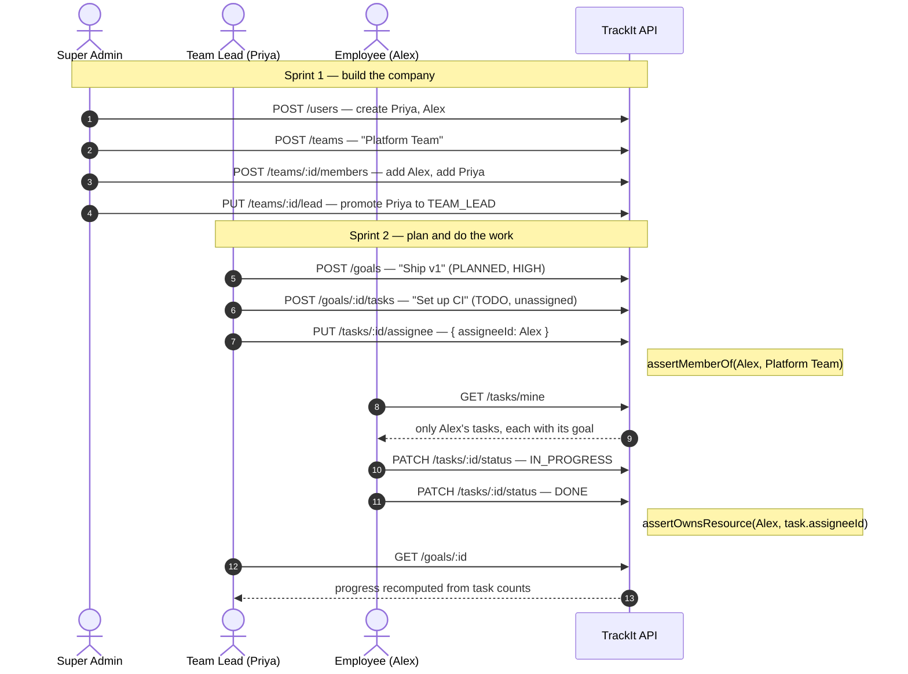

---

## 8. API reference

All responses are JSON. Errors use `{ "error": { "message": "..." } }`. Dates are strict
`YYYY-MM-DD` strings, validated at the boundary. Every route except `/auth/login` and `/health`
requires `Authorization: Bearer <jwt>`.

### Auth & infrastructure

| Method | Path | Access | Request | Success | Notable errors |
| --- | --- | --- | --- | --- | --- |
| POST | `/auth/login` | public | `{ email, password }` | `200 { token, user }` | 401 invalid credentials |
| GET | `/auth/me` | authenticated | — | `200 { user }` | 401 |
| GET | `/health` | public | — | `200 { status, database }` | 503 database down |

### Users

| Method | Path | Access | Request | Success | Notable errors |
| --- | --- | --- | --- | --- | --- |
| POST | `/users` | SUPER_ADMIN | `{ name, email, password, role }` | `201 { user }` | 400, 401, 403, 409 duplicate email |
| GET | `/users` | SUPER_ADMIN | query `role?`, `unassigned?` | `200 { users }` | 401, 403 |

### Teams

| Method | Path | Access | Request | Success | Notable errors |
| --- | --- | --- | --- | --- | --- |
| POST | `/teams` | SUPER_ADMIN | `{ name, description?, weeklyCapacityHours? }` | `201 { team }` | 401, 403, 409 duplicate name |
| GET | `/teams` | authenticated | — | `200 { teams }` (role-scoped) | 401 |
| GET | `/teams/:id` | authenticated | — | `200 { team }` (lead, members, memberCount) | 401, 403, 404 |
| POST | `/teams/:id/members` | SUPER_ADMIN | `{ userId }` | `201 { member }` | 401, 403, 404, 409 |
| DELETE | `/teams/:id/members/:userId` | SUPER_ADMIN | — | `204` | 401, 403, 404, 409 lead not reassigned |
| PUT | `/teams/:id/lead` | SUPER_ADMIN | `{ userId }` | `200 { lead }` | 401, 403, 404, 409 not a member |

### Goals

| Method | Path | Access | Request | Success | Notable errors |
| --- | --- | --- | --- | --- | --- |
| POST | `/goals` | SUPER_ADMIN, TEAM_LEAD | `{ teamId, title, description?, startDate, deadline, importance }` | `201 { goal }` | 400 dates, 401, 403 |
| GET | `/teams/:teamId/goals` | authenticated | query `status?` | `200 { goals }` (with progress) | 401, 403 |
| GET | `/goals/:id` | authenticated | — | `200 { goal }` (progress + breakdown) | 401, 403, 404 |
| PATCH | `/goals/:id` | SUPER_ADMIN, TEAM_LEAD | partial `{ title?, description?, startDate?, deadline?, status?, importance? }` | `200 { goal }` | 400, 401, 403, 404 |

### Tasks

| Method | Path | Access | Request | Success | Notable errors |
| --- | --- | --- | --- | --- | --- |
| POST | `/goals/:goalId/tasks` | SUPER_ADMIN, TEAM_LEAD | `{ title, description?, priority, estimatedHours, dueDate }` | `201 { task }` | 400 estimate, 401, 403, 404 |
| GET | `/goals/:goalId/tasks` | authenticated | — | `200 { tasks }` (role-scoped) | 401, 403, 404 |
| GET | `/tasks/mine` | authenticated | query `status?`, `dueBefore?` | `200 { tasks }` (with parent goal) | 400, 401 |
| GET | `/tasks/:id` | authenticated | — | `200 { task }` | 401, 403, 404 |
| PATCH | `/tasks/:id` | SUPER_ADMIN, TEAM_LEAD | partial `{ title?, description?, priority?, estimatedHours?, dueDate? }` | `200 { task }` | 400, 401, 403, 404 |
| PATCH | `/tasks/:id/status` | authenticated (role-branched) | `{ status }` | `200 { task }` | 401, 403, 404 |
| PUT | `/tasks/:id/assignee` | TEAM_LEAD | `{ assigneeId \| null }` | `200 { task }` | 401, 403, 404 |

---

## 9. Running & verifying end to end

### With Docker Compose (recommended)

```bash
cp backend/.env.example backend/.env   # first time only
docker compose up
```

- Frontend: http://localhost:5173
- API: http://localhost:3000
- PostgreSQL: localhost:5432

### On the host

```bash
# backend
cd backend && cp .env.example .env && npm install && npm run dev

# frontend (separate shell) — set VITE_API_URL to the API base URL
cd frontend && npm install && npm run dev
```

`JWT_SECRET` must be at least 32 characters; env vars are validated at boot
(`backend/src/common/config/env.ts`), so a misconfigured environment fails immediately rather than
at the first request.

### Migrate and seed

```bash
cd backend
npm run migration:run    # applies all seven migrations
npm run seed
```

The seed (`backend/src/scripts/seeds/company-structure.seed.ts`) is **idempotent** — records are
keyed by email and team name, so a second run changes nothing. It creates 2 teams and 9 users;
every account's password is `TrackIt123!`:

| Name | Role | Team | Email |
| --- | --- | --- | --- |
| TrackIt Admin | Super Admin | — | `admin@trackit.local` |
| Priya | Team Lead | Platform Team | `priya@trackit.local` |
| Alex | Employee | Platform Team | `alex@trackit.local` |
| Maya | Employee | Platform Team | `maya@trackit.local` |
| Jordan | Employee | Platform Team | `jordan@trackit.local` |
| Diego | Employee | Platform Team | `diego@trackit.local` |
| Sam | Team Lead | Frontend Team | `sam@trackit.local` |
| Elena | Employee | Frontend Team | `elena@trackit.local` |
| Noah | Employee | Frontend Team | `noah@trackit.local` |

**The seed creates no goals or tasks** — those are created through the UI or the API, so the
Sprint 2 flow is exercised for real rather than pre-baked.

### Verify the API from the command line

```bash
# health — proves route → database
curl http://localhost:3000/health
# → {"status":"ok","database":"up"}

# log in as a Team Lead
TOKEN=$(curl -s http://localhost:3000/auth/login \
  -H 'Content-Type: application/json' \
  -d '{"email":"priya@trackit.local","password":"TrackIt123!"}' | jq -r .token)

# scoped team list — Priya sees only the team she leads
TEAM=$(curl -s http://localhost:3000/teams -H "Authorization: Bearer $TOKEN" | jq -r '.teams[0].id')

# create a goal under that team
GOAL=$(curl -s http://localhost:3000/goals -H "Authorization: Bearer $TOKEN" \
  -H 'Content-Type: application/json' \
  -d "{\"teamId\":\"$TEAM\",\"title\":\"Ship v1\",\"startDate\":\"2026-08-01\",\"deadline\":\"2026-09-01\",\"importance\":\"HIGH\"}" \
  | jq -r .goal.id)

# add a task, then read the goal back to see progress
curl -s http://localhost:3000/goals/$GOAL/tasks -H "Authorization: Bearer $TOKEN" \
  -H 'Content-Type: application/json' \
  -d '{"title":"Set up CI","priority":"HIGH","estimatedHours":8,"dueDate":"2026-08-15"}'

curl http://localhost:3000/goals/$GOAL -H "Authorization: Bearer $TOKEN"
# → progress 0, noTasksYet false, taskStatusBreakdown.total 1
```

### Verify in the browser

1. **As Super Admin** (`admin@trackit.local`) — open **Users** and **Teams**: create a user,
   create a team, add employees, assign a lead.
2. **As Team Lead** (`priya@trackit.local`) — the team list is scoped to her team only. Open
   **Goals and Tasks**: create a goal, open it, add tasks, assign one to Alex, and watch progress
   move as you mark a task `DONE`.
3. **As Employee** (`alex@trackit.local`) — **Team Goals** shows the team's goals read-only, and
   **My Tasks** shows only Alex's assigned tasks with a status selector. That last point is the
   query-level scoping, visible.

### Tests

```bash
cd backend  && npm test                        # 161 tests, all passing
cd frontend && node --test src/**/*.test.ts    # navigation, goal display, my-task sorting
```

Backend coverage spans all four layers of every module — `auth`, `users`, `teams`, `goals`,
`tasks` — plus the middleware, `ScopeService`, and the seed's idempotency.

---

## 10. Known limitations & follow-ups

**Accepted trade-offs**

- **Progress is counted, not weighted.** A goal with one 40-hour task and nine 1-hour tasks reads
  90% done when the small ones finish. Accepted for simplicity (`DOMAIN.md` §Goal progress).
- **Goal status is manual by design.** Never derived from task counts, so a goal at 100% progress
  stays `ACTIVE` until a human marks it `COMPLETED` — which keeps `CANCELLED` a deliberate
  decision.
- **JWT in `localStorage`.** Convenient for this simulation and survives reloads, but exposed to
  XSS. Refresh tokens and production-grade cookie sessions are deliberately out of scope.
- **No deletion of goals or tasks.** They can be created and updated but not deleted via the API;
  the `RESTRICT` foreign keys anticipate this being a deliberate future operation rather than a
  cascade.

**Inert by design — reserved for later phases**

- `Task.businessImpact` and `Task.priorityScore` are always `null`, and `Goal.importance` /
  `Task.priority` are stored but never combined into a score. The `constants.ts` scoring tunables
  are unused.
- No task dependencies. The `TaskDependency` / blocked-by model from `DOMAIN.md` has no table or
  endpoints; `BLOCKED` today is only a manually set lifecycle status.
- No time logging. `estimatedHours` exists but there is no way to record actual hours.
- `Team.weeklyCapacityHours` is stored and settable but nothing consumes it yet — utilisation and
  workload are Phase 2.

**Known drift**

- The root `README.md` "Running the frontend" section still describes the Vite proxy
  (`VITE_API_TARGET`) removed by TRACKIT-39. The frontend now calls the API directly via
  `VITE_API_URL`.

**What Phase 2 picks up (TRACKIT-24 → 30)**

Timesheet entries against tasks, effort variance (`recorded − estimated`), utilisation and
workload classification against `Team.weeklyCapacityHours`, and the first dashboards. Every one of
those builds directly on what is documented above: `tasks.estimatedHours`, `tasks.assigneeId`, and
the team scope model.
