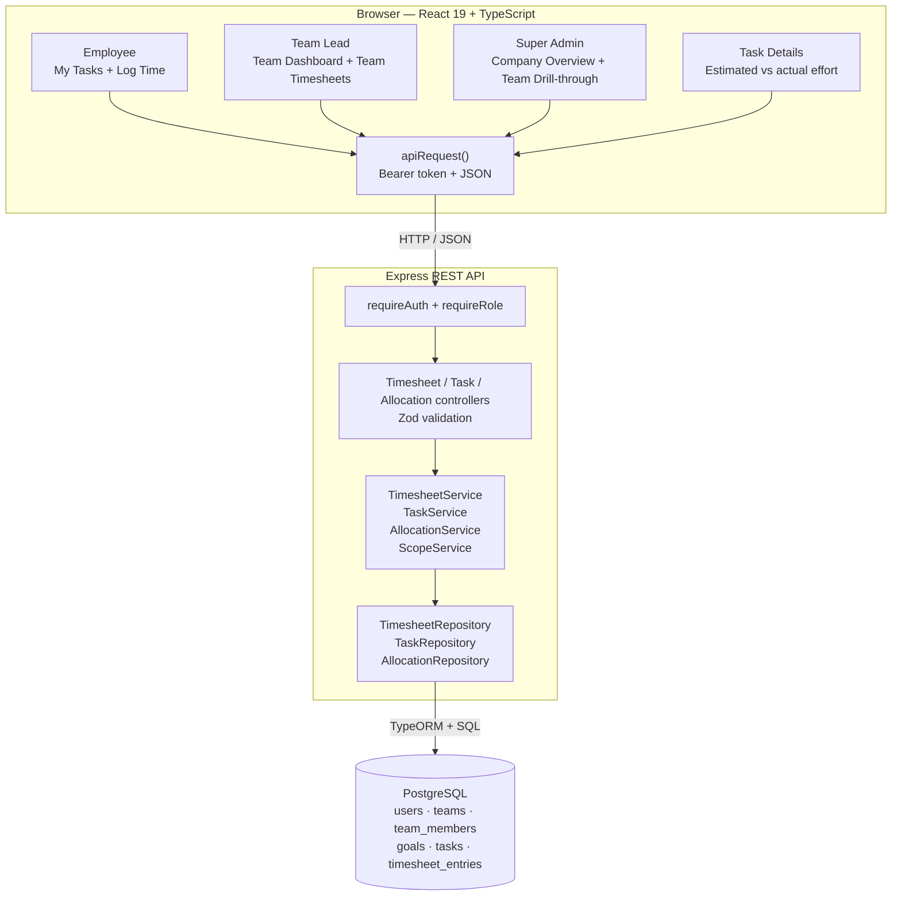
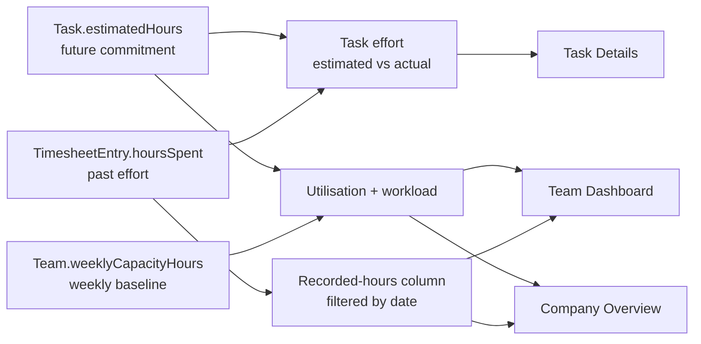
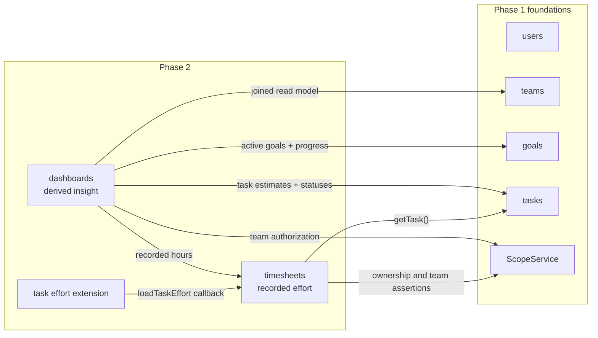
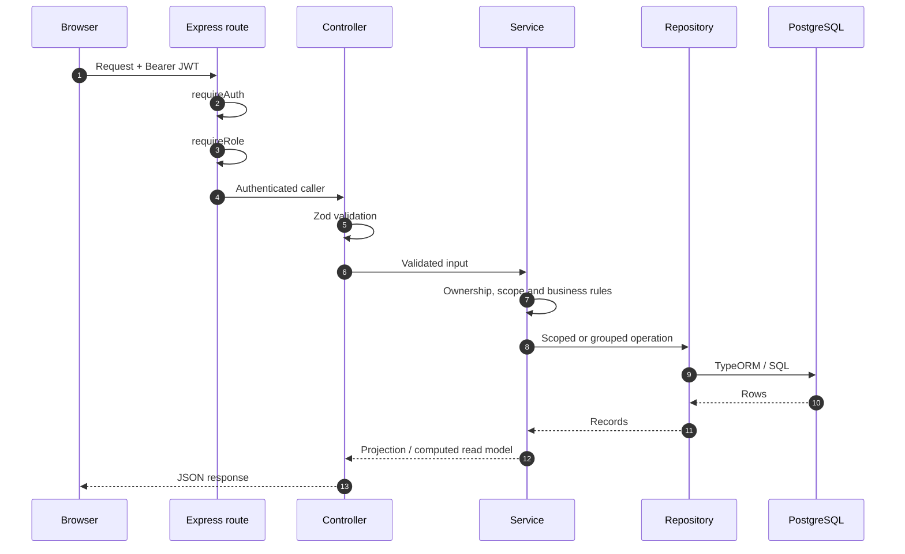
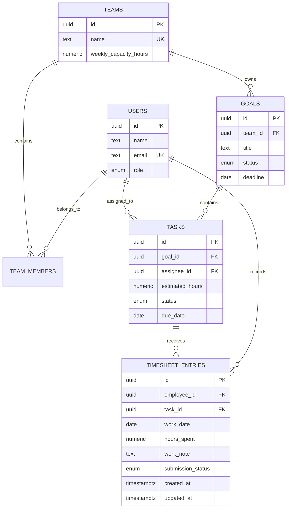
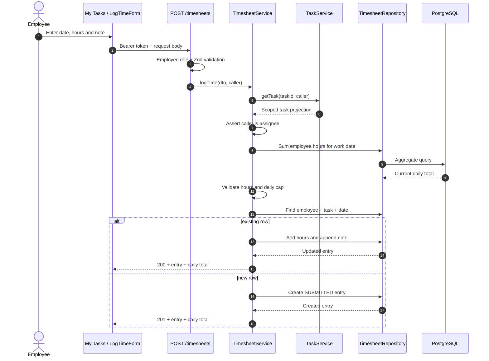
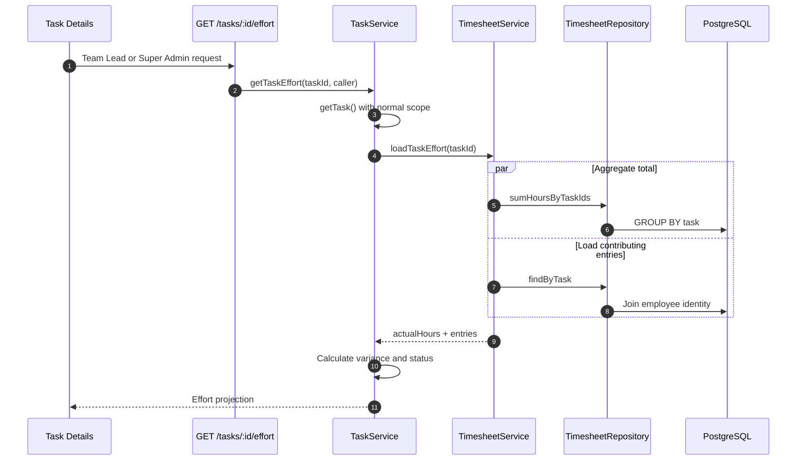
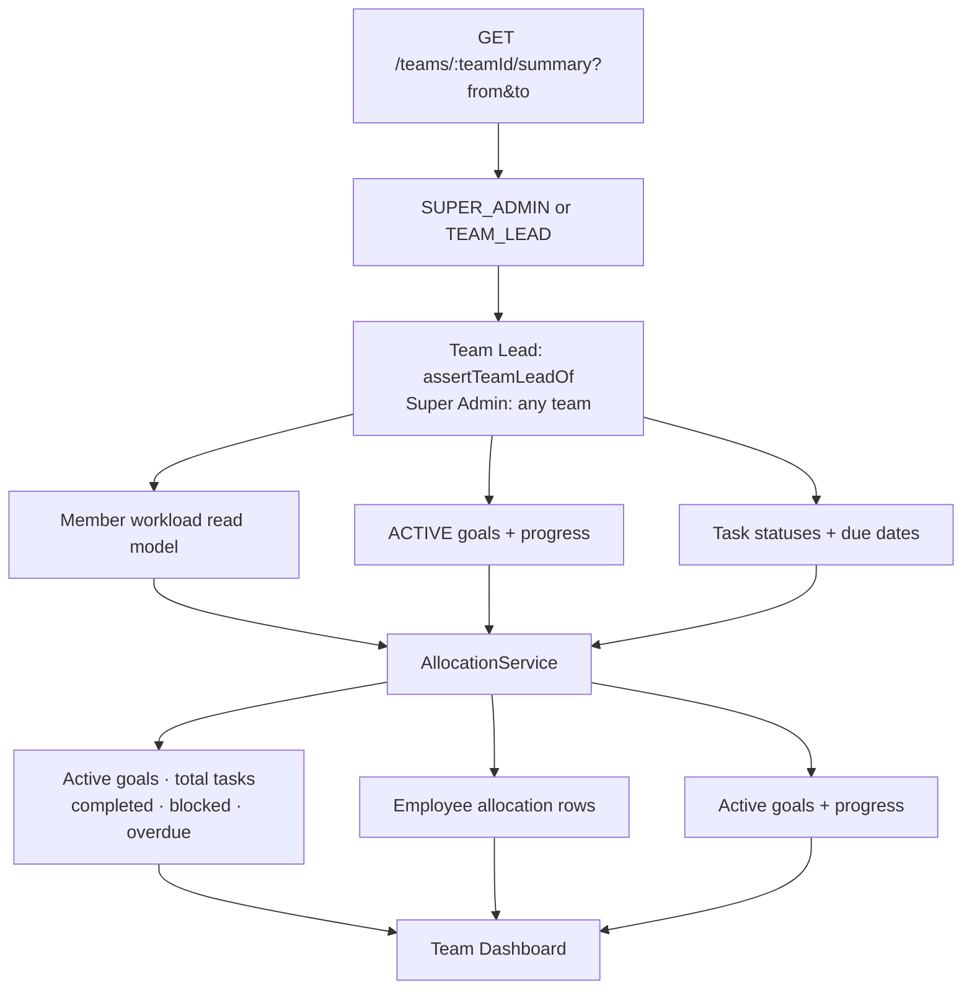
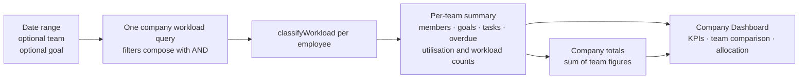
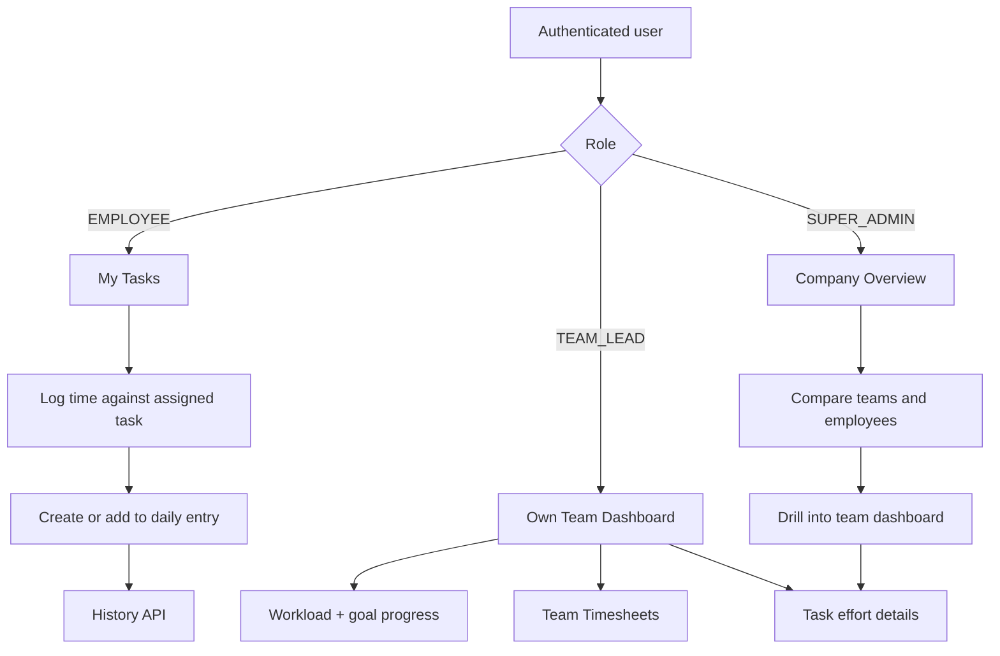

# TrackIt — Phase 2 End-to-End

**Purpose.** This page explains what TrackIt Phase 2 delivered and how it works end to end — from role-specific React screens, through the REST API and service layer, down to the PostgreSQL queries and schema. It is written for **technical stakeholders**: engineering, architecture, QA, and technically minded product owners who need to understand the delivered system without reading every source file.

**Scope of Phase 2:** **Timesheets and resource management** across the _Effort_ and _Insight_ contexts — employee time recording, correction and history, task effort variance, Team Lead timesheet visibility, workload classification, team dashboards, and the Super Admin company overview. It covers Sprints 3–4, Epics 3–4, and TRACKIT-24 through TRACKIT-30.

This document describes the system **as built**, not the original ticket aspirations or the full product vision.

- [Phase 1 — Core Task Management: End-to-End Technical Overview](https://kavindaweerasinghe.atlassian.net/wiki/spaces/TR/pages/7110722)
- [TrackIt — Phases](https://kavindaweerasinghe.atlassian.net/wiki/spaces/TR/pages/7372837)
- Domain source of truth: **docs/DOMAIN.md**
- Engineering rules: **AGENTS.md**
- Module contracts: **backend/src/modules/timesheets/README.md** and **backend/src/modules/dashboards/README.md**

---

## 1. Where Phase 2 sits

TrackIt is delivered in three phases. Phase 1 established who exists, how people are grouped, what work exists, and who owns it. Phase 2 adds actual effort and turns those operational records into workload insight.

| Phase                                              | Sprints | Tickets                          | Scope                                                  | Status           |
| -------------------------------------------------- | ------- | -------------------------------- | ------------------------------------------------------ | ---------------- |
| Phase 1 — Core task management                     | 1–2     | TRACKIT-12 → 23, plus TRACKIT-39 | Authentication, teams, goals, tasks, assignment        | Delivered        |
| **Phase 2 — Timesheets & resource management**     | **3–4** | **TRACKIT-24 → 30**              | **Time logging, effort tracking, workload dashboards** | **Delivered**    |
| Phase 3 — Prioritisation, risk & advanced features | 5–6     | TRACKIT-31 → 38                  | Dependencies, ranking, risk, audit                     | Not covered here |

Phase 2 depends on the complete Phase 1 chain:

**User → Team membership → Goal → Task → Assignee**

A timesheet entry cannot exist meaningfully until that chain exists. Workload then combines the **estimated hours** already carried by tasks with the **recorded hours** introduced in this phase.

### Tickets delivered

| Ticket                                                                   | Epic   | Delivered behavior                                                                                      |
| ------------------------------------------------------------------------ | ------ | ------------------------------------------------------------------------------------------------------- |
| [TRACKIT-24](https://kavindaweerasinghe.atlassian.net/browse/TRACKIT-24) | Epic 3 | Employee records daily time against an assigned task; duplicate task/day logs add to the existing entry |
| [TRACKIT-25](https://kavindaweerasinghe.atlassian.net/browse/TRACKIT-25) | Epic 3 | Employee edits or deletes only their own entries; edited hours are revalidated                          |
| [TRACKIT-26](https://kavindaweerasinghe.atlassian.net/browse/TRACKIT-26) | Epic 3 | Personal timesheet history API with inclusive date filtering and daily/task rollups                     |
| [TRACKIT-27](https://kavindaweerasinghe.atlassian.net/browse/TRACKIT-27) | Epic 3 | Task estimated-versus-actual effort and Team Lead team-timesheet view                                   |
| [TRACKIT-28](https://kavindaweerasinghe.atlassian.net/browse/TRACKIT-28) | Epic 4 | Shared workload calculation and constant-query employee allocation data                                 |
| [TRACKIT-29](https://kavindaweerasinghe.atlassian.net/browse/TRACKIT-29) | Epic 4 | Team dashboard with KPIs, employee workload, active goals, and date filtering                           |
| [TRACKIT-30](https://kavindaweerasinghe.atlassian.net/browse/TRACKIT-30) | Epic 4 | Super Admin company overview with team comparisons, employee allocation, and filters                    |

The seven child stories are marked **Done** and have corresponding implementation commits. At publication time, parent [TRACKIT-8](https://kavindaweerasinghe.atlassian.net/browse/TRACKIT-8) and [TRACKIT-9](https://kavindaweerasinghe.atlassian.net/browse/TRACKIT-9) still show **To Do**. That is a Jira tracking inconsistency; delivery status on this page is based on the completed stories, repository history, passing tests, and successful builds.

### Modules delivered

- **timesheets** — owns persisted recorded effort.
- **dashboards** — owns read-only workload and allocation insight.

Phase 2 also extends **tasks** with task-effort calculations and UI presentation. It reuses **goals**, **teams**, **users**, authentication, and shared scope authorization from Phase 1.

---

## 2. The system in one picture



The most important Phase 2 data flow is:



Estimated and recorded hours are intentionally different signals. Estimated hours determine current allocation; recorded hours describe past effort. A date filter changes recorded hours but does not rewrite the active commitment.

---

## 3. Architecture and module boundaries

Phase 2 keeps the modular-monolith and four-layer convention introduced in Phase 1:

| Layer      | Responsibility in Phase 2                                                     |
| ---------- | ----------------------------------------------------------------------------- |
| Controller | Express routes, role gates, request/parameter/query validation, HTTP status   |
| Service    | Ownership, team scope, business validation, calculations, orchestration       |
| Repository | TypeORM persistence, scoped joins, grouped SQL and constant-query aggregation |
| Entity     | TypeORM mapping for persisted data only                                       |

The **timesheets** module has all four layers because it owns the persisted **TimesheetEntry** entity. The **dashboards** module deliberately has no persistence entity: dashboards are computed read models, so the module contains controller, service, repository, and README but does not create a dashboard table.

### Module dependencies



Every cross-module business read goes through a service. The dashboard repository is the deliberate read-model boundary: it joins several tables because its job is to produce an aggregate view, not to mutate another module’s data.

### Hand-wired dependency graph

Dependencies remain explicit in **backend/src/app.ts**; there is no dependency-injection framework.

A small callback breaks the otherwise circular task/timesheet relationship:

1. **TimesheetService** needs **TaskService** to validate task visibility and assignment before logging time.
2. **TaskService** needs recorded effort to build task-effort details.
3. Rather than importing TimesheetService directly, TaskService accepts a narrow **loadTaskEffort(taskId)** function.
4. The application wiring connects that function to **timesheetService.getTaskEffortSource(taskId)**.

This keeps the dependency readable and limits the cross-module contract to exactly the data TaskService needs.

### Normal request lifecycle



Controllers never import repositories. Services never set HTTP status codes. The central error handler preserves the Phase 1 response contract:

```json
{ "error": { "message": "..." } }
```

---

## 4. Authorization and data visibility

Phase 2 continues the two-place authorization model:

1. **Role at the route** with requireAuth and requireRole.
2. **Resource scope in the service**, backed by query-level filtering where data is listed or aggregated.

| Capability                | Employee           | Team Lead      | Super Admin      |
| ------------------------- | ------------------ | -------------- | ---------------- |
| Log time                  | Own assigned tasks | No             | No               |
| Edit/delete an entry      | Own entries        | No             | No               |
| Read personal history API | Own history        | No             | No               |
| View task effort entries  | No                 | Own team       | Any visible task |
| View team timesheets      | No                 | Team they lead | No               |
| View team dashboard       | No                 | Team they lead | Any team         |
| View company dashboard    | No                 | No             | All teams        |

Important consequences:

- Logging against an unassigned task or another employee’s task returns **403**.
- Editing or deleting another employee’s entry returns **403**.
- Team Leads observe timesheets but cannot rewrite them.
- The team-timesheet route is Team-Lead-only; Super Admins do not receive an implicit exception.
- A Team Lead requesting another team’s dashboard or timesheets receives **403**.
- Employees cannot view task effort entries because those entries expose contributor identity.
- Company aggregation is Super-Admin-only at both the route and service boundaries.

Scope is applied before rows leave PostgreSQL. Team history joins through task → goal → team. Allocation starts from team membership and left-joins tasks and timesheets, so users outside the selected scope are never loaded and filtered afterward in React.

---

## 5. Data model

Phase 2 adds one persisted table. Workload, utilisation, effort variance, dashboard KPIs, and rollups remain computed on read.



### Timesheet-entry constraints

| Rule                                     | Enforcement                                                   |
| ---------------------------------------- | ------------------------------------------------------------- |
| Entry references one employee            | employee_id → [users.id](http://users.id), ON DELETE RESTRICT |
| Entry references one task                | task_id → [tasks.id](http://tasks.id), ON DELETE RESTRICT     |
| One row per employee, task and work date | UNIQUE(employee_id, task_id, work_date)                       |
| Employee/date lookups remain efficient   | INDEX(employee_id, work_date)                                 |
| Hours are positive and within limits     | Service validation                                            |
| Daily total does not exceed 12 hours     | Service validation plus grouped sum                           |
| Work date is not in the future           | Service validation                                            |
| Entry owner is the task assignee         | Service reads the task before persistence                     |
| Approval workflow does not exist         | submission_status remains SUBMITTED                           |

The migration is **1754640700000-CreateTimesheetEntries**. TypeORM synchronize remains disabled; the schema changes only through migrations.

There are no dashboard, utilisation, workload, variance, or total columns. Storing any of those values would allow them to become stale when a task estimate, task status, capacity, or timesheet entry changes.

---

## 6. Shared calculations and invariants

### 6.1 Daily time validation

For a new entry:

```
new daily total = existing hours across all tasks for the date + submitted hours
```

For an edit:

```
adjusted daily total = current daily total - old entry hours + replacement hours
```

The submitted or replacement value must be finite, greater than zero, and no more than **12 hours**. The resulting daily total must also be no more than **12 hours**.

### 6.2 Duplicate time logging

The resolved duplicate rule is **upsert by addition**.

If the same employee logs time again for the same task and work date:

- no second row is created;
- the new hours are added to the existing row;
- a non-empty work note is appended on a new line;
- an empty new note preserves the existing note;
- the API returns **200** instead of **201**.

The database unique constraint protects the same invariant at the storage level.

### 6.3 History ranges

Personal and team timesheet history use inclusive YYYY-MM-DD ranges.

- Both from and to must be supplied together.
- From must be on or before to.
- The inclusive range cannot exceed **90 days**.
- Omitting the range uses the current UTC Monday-to-Sunday week.

### 6.4 Effort variance

```
variance hours = actual recorded hours - estimated hours
variance percent = variance hours / estimated hours × 100
```

| Status         | Rule                                 |
| -------------- | ------------------------------------ |
| UNDER_ESTIMATE | actual < estimate                    |
| ON_ESTIMATE    | actual = estimate                    |
| OVER_ESTIMATE  | estimate < actual ≤ 120% of estimate |
| OVERRUN        | actual > 120% of estimate            |

Exactly 120% is **OVER_ESTIMATE**; **OVERRUN** begins above the configured threshold. Division is guarded when an estimate is zero even though normal task creation rejects non-positive estimates.

### 6.5 Utilisation and workload

```
utilisation = estimated hours on active tasks / weekly capacity hours × 100
```

**Active** means task status is anything other than DONE. A task manually marked BLOCKED still occupies capacity.

| Utilisation   | Classification |
| ------------- | -------------- |
| ≤ 60%         | AVAILABLE      |
| 60% and ≤ 90% | BALANCED       |
| 90%           | OVERLOADED     |

The pure **classifyWorkload(estimatedHours, capacityHours)** function is the single shared definition used by dashboards and reserved for Phase 3 overload risk detection.

### 6.6 Date ranges do not change allocation

Date filters apply only to **recorded hours**. Active-task estimates always compare against one weekly capacity baseline, even if the selected recorded-hours range covers several weeks. This is deliberate: recorded hours are historical activity; estimates are the current assignment.

### 6.7 Dashboard task definitions

- **Completed:** status is DONE.
- **Blocked:** persisted task status is BLOCKED.
- **Overdue:** due date is before today and status is not DONE.
- **Goal progress:** completed task count divided by total task count, inherited from Phase 1.

Dependency-derived blocking is not part of Phase 2 and arrives with Phase 3 task dependencies.

---

## 7. Feature walkthroughs

### 7.1 Employee logs time from My Tasks — TRACKIT-24

The Employee opens **My Tasks**, selects **Log Time** on an assigned task, and submits date, hours, and an optional work note.



The UI confirms the new running total. Server checks remain authoritative even though the form also provides immediate validation feedback.

### 7.2 Employee corrects or removes an entry — TRACKIT-25

PATCH and DELETE first load the entry, return 404 if it does not exist, then use **assertOwnsResource** to enforce ownership.

An hours edit reruns the same validation used by creation, subtracting the previous value before testing the new daily total. Editing cannot bypass the daily cap. Work notes may be replaced or cleared. Deletion returns 204 and immediately removes the entry from future totals.

The backend capability is complete. A dedicated personal history screen with row-level edit/delete controls is not currently present in the React route tree.

### 7.3 Personal history and rollups — TRACKIT-26

**GET /timesheets/mine** runs three independent repository operations in parallel:

1. joined entries with task and goal identity;
2. totals grouped by work date;
3. totals grouped by task.

All three operations include the employee ID and date bounds in SQL. The response is ready for a personal history page, but Phase 2 currently exposes it as an API capability only.

### 7.4 Task estimated-versus-actual effort — TRACKIT-27



The Task Details panel displays estimate, actual total, variance label, progress visualization, and contributing entries. Employees do not receive this contributor-level view.

### 7.5 Team Lead timesheet view — TRACKIT-27

The Team Lead opens **/teams/:id/timesheets** from Team Details. The page defaults to the current week, allows an inclusive date filter, and groups rows by employee. Each row includes employee, task, goal, date, hours, and note.

The service calls **assertTeamLeadOf** before the repository query. The SQL joins entries through tasks and goals and scopes by the requested team, so another team’s entries never reach application memory.

### 7.6 Shared workload calculation — TRACKIT-28

Allocation reads start from team members and use left joins. This preserves employees with:

- no assigned tasks;
- no active tasks;
- no entries in the selected date range.

Those employees appear with zero active tasks, zero estimated hours, zero recorded hours, 0% utilisation, and AVAILABLE status. An inner join would incorrectly drop the most visibly available people.

The company query uses common-table expressions for filtered goals, task metrics, timesheet metrics, goal metrics, and team task data. It remains one aggregate query regardless of the number of teams or employees.

### 7.7 Team dashboard — TRACKIT-29



A Team Lead sees their own team dashboard at the application home page. A Super Admin can drill into **/teams/:id/dashboard** from the company comparison table.

The UI includes:

- five KPI cards;
- employee allocation with active-task count, estimate, recorded hours, utilisation, and workload;
- active goals with Phase 1 progress;
- current-week defaults and explicit date filtering;
- loading skeletons, errors, no-team state, and no-active-goals state.

### 7.8 Super Admin company overview — TRACKIT-30



The backend accepts optional **teamId**, **goalId**, and paired date filters. The React company screen currently exposes team and date filters to the API. Its employee selector filters the already returned employee table locally; it does not issue an employee-filtered company query. The backend goal filter is not yet exposed in the UI.

Team comparison deliberately shows overloaded-member count beside average utilisation. An average alone can hide one severely overloaded employee behind several underutilised employees.

### 7.9 Role journeys end to end



---

## 8. API reference

All endpoints require a valid Bearer JWT. Date-only inputs use YYYY-MM-DD.

| Method and path                                | Role                   | Important behavior                                                                           | Success                            |
| ---------------------------------------------- | ---------------------- | -------------------------------------------------------------------------------------------- | ---------------------------------- |
| POST /timesheets                               | Employee               | Own assigned task only; validates date/hours/daily cap; upserts duplicate                    | 201 new row, 200 added to existing |
| PATCH /timesheets/:id                          | Employee               | Own entry only; partial hours/note update; revalidates adjusted daily total                  | 200                                |
| DELETE /timesheets/:id                         | Employee               | Own entry only                                                                               | 204                                |
| GET /timesheets/mine?from=&to=                 | Employee               | Own entries plus daily/task totals; paired optional range; current week default; max 90 days | 200                                |
| GET /teams/:teamId/timesheets?from=&to=        | Team Lead              | Team they lead; joined employee/task/goal rows; current week default                         | 200                                |
| GET /tasks/:id/effort                          | Team Lead, Super Admin | Normal task scope; estimate, actual, variance, status, contributor entries                   | 200                                |
| GET /teams/:teamId/summary?from=&to=           | Team Lead, Super Admin | Paired required range; scoped KPIs, workloads and active goals                               | 200                                |
| GET /company/summary?from=&to=&teamId=&goalId= | Super Admin            | Optional paired range with current-week default; filters compose with AND                    | 200                                |

### Main response shapes

**Log time**

```json
{
  "timesheetEntry": {
    "id": "uuid",
    "employeeId": "uuid",
    "taskId": "uuid",
    "workDate": "2026-08-08",
    "hoursSpent": 3,
    "workNote": "Implemented and tested",
    "createdAt": "timestamp",
    "updatedAt": "timestamp"
  },
  "dailyTotalHours": 7
}
```

**Personal history**

```json
{
  "range": { "from": "2026-08-03", "to": "2026-08-09" },
  "entries": [],
  "dailyTotals": [],
  "taskTotals": []
}
```

**Task effort**

```json
{
  "effort": {
    "estimatedHours": 10,
    "actualHours": 12,
    "variance": 2,
    "variancePercent": 20,
    "varianceStatus": "OVER_ESTIMATE",
    "entries": []
  }
}
```

**Team summary**

```json
{
  "range": { "from": "2026-08-03", "to": "2026-08-09" },
  "kpis": {
    "activeGoals": 2,
    "totalTasks": 12,
    "completedTasks": 4,
    "blockedTasks": 1,
    "overdueTasks": 2
  },
  "employees": [],
  "activeGoals": []
}
```

**Company summary**

```json
{
  "range": { "from": "2026-08-03", "to": "2026-08-09" },
  "filters": { "teamId": null, "goalId": null },
  "kpis": {
    "totalTeams": 3,
    "totalEmployees": 14,
    "activeGoals": 5,
    "totalTasks": 31,
    "overdueTasks": 4
  },
  "teams": [],
  "employees": []
}
```

The numeric examples illustrate response shape only; live values are computed from current data.

### Error behavior

| Situation                                  | Status |
| ------------------------------------------ | ------ |
| Missing, expired or malformed token        | 401    |
| Valid token with wrong role                | 403    |
| Resource outside caller scope or not owned | 403    |
| Malformed UUID, date or request body       | 400    |
| Reversed, incomplete or excessive range    | 400    |
| Invalid hours or daily total above 12      | 400    |
| Missing entry or task                      | 404    |

---

## 9. Frontend surface

### Employee

- **/tasks** — My Tasks list and status filters.
- **Log Time** action — inline form for date, hours and note.
- The successful response displays the running daily total.
- No standalone **/timesheets** route exists yet.

### Team Lead

- **/** — automatically renders the Team Dashboard for the led team.
- **/teams/:id/timesheets** — team entries grouped by employee.
- **/tasks/:id** — Task Details includes estimated-versus-actual effort.
- Team Dashboard date filters update recorded hours while estimates and weekly capacity remain unchanged.

### Super Admin

- **/** — automatically renders the Company Dashboard.
- Company KPI cards, team comparison, and company employee allocation.
- Team and date filters are server-side.
- Employee selection filters the returned employee table client-side.
- Team rows link to **/teams/:id/dashboard**.
- Task Details includes effort visibility.
- Super Admin cannot use the Team-Lead-only team-timesheet route.

All screens use the shared API client and Phase 1 authentication context. Loading, empty, and error states are presented in the screen that owns the request.

---

## 10. Query and performance design

Phase 2 is the first aggregation-heavy part of TrackIt. The implementation follows the repository’s query rules deliberately.

### Timesheet queries

- Ownership-sensitive lists filter employee ID in SQL.
- Team history filters through task → goal → team in SQL.
- Daily and per-task history totals use GROUP BY, not JavaScript accumulation.
- Task effort totals can accept task ID batches and return a keyed map.
- Empty task sets skip the aggregate query.

### Allocation queries

- The query starts from **teams** and **team_members**.
- Tasks and timesheets are **left joined**, preserving members with zero work.
- Active estimates and recorded hours are aggregated separately so a task/entry join cannot multiply totals.
- Date filters appear only in the timesheet metrics.
- Team, goal, and date filters compose with AND.
- The company read model uses one SQL query regardless of team or member count.
- Team summaries use a constant number of aggregate reads regardless of member count.
- Goal progress continues to use grouped Phase 1 task counts rather than one count query per goal.

### Why calculations remain in services

Repositories return facts: estimates, counts, recorded hours, capacity, statuses, and dates. Services apply domain meaning: utilisation, workload classification, overdue state, effort variance, and response projections. This keeps SQL focused on set operations while preserving one reusable definition of each business rule.

---

## 11. Running and verification

### Local verification commands

```shell
cd backend
npm test
npm run build

cd ../frontend
npm test
npm run build
```

### Verification at publication

| Check                                       | Result                   |
| ------------------------------------------- | ------------------------ |
| Backend tests                               | **262 passed, 0 failed** |
| Frontend tests                              | **8 passed, 0 failed**   |
| Backend TypeScript build                    | Passed                   |
| Frontend TypeScript + Vite production build | Passed                   |

The backend suite covers route roles, scope rejection, time ownership, duplicate upsert, future dates, hour validation, daily limits, history ranges, task effort, workload thresholds, zero-task employees, composed filters, constant-query repository shapes, KPIs, and default-week behavior.

The frontend suite currently covers shared display, sorting, and navigation helpers. The production build verifies the complete Phase 2 React route/component graph type-checks and bundles successfully.

### High-value acceptance checks

1. Employee logs twice against the same task/date: one row remains, hours add, notes append.
2. Employee tries to log another employee’s task: 403 and no write.
3. Edit would push the day above 12 hours: 400 and original entry remains.
4. Team Lead requests another team’s timesheets or dashboard: 403.
5. Employee with no tasks appears in allocation as AVAILABLE with zero values.
6. Changing the dashboard date range changes recorded hours only.
7. Company totals equal sums of the returned per-team figures.
8. Team and goal backend filters compose rather than replace each other.
9. DONE tasks leave active estimates and are never overdue.
10. Task effort above 120% receives OVERRUN; exactly 120% remains OVER_ESTIMATE.

---

## 12. Known limitations and Phase 3 handoff

### Deliberate Phase 2 limits

- **No timesheet approval workflow.** submissionStatus is always SUBMITTED.
- **No standalone personal history UI.** The personal history, edit and delete APIs exist, but the React application does not yet expose a My Timesheet page.
- **No derived-value storage.** Workload, utilisation, variance, progress, and dashboard totals are calculated on read.
- **No future capacity planning.** Allocation represents current active-task commitments against one weekly capacity.
- **No scaling by date-range length.** Longer ranges widen recorded-hour history only.
- **No cost, billing, payroll, invoicing, timers, or automatic tracking.**
- **No CSV export.**
- **No automatic assignment or scheduling.**
- **No dependency-derived blocking.** The blocked KPI uses the task’s persisted BLOCKED status.
- **No risk notifications.** Phase 2 displays overdue and overloaded conditions but does not turn them into risk records or alerts.

### Small interface gaps to be aware of

- The company backend accepts a goalId filter; the current UI does not expose it.
- The company employee selector is a client-side table filter rather than an API filter.
- Super Admin can inspect task effort and dashboards but cannot open the Team-Lead-only team-timesheet route.
- Jira parent Epics 3 and 4 remain To Do even though all seven Phase 2 stories are Done.

### Phase 3 reuses these foundations

Phase 3 should import rather than retype:

- **classifyWorkload** for overloaded-employee risk;
- **isTaskOverdue** for overdue-task risk;
- effort totals and the configured 120% threshold for estimate-overrun risk;
- Phase 1 goal progress for deadline/progress risk;
- the same query-level team/company scope patterns for risk dashboards.

Phase 2 therefore changes TrackIt from a record of assigned work into an operational management tool: employees record actual effort, Team Leads see delivery and workload for their team, and Super Admins see the same consistent calculations across the company.
